# 1×8 Demultiplexer (VLSI Design)

## Overview

This project presents the design and implementation of a 1×8 Demultiplexer using CMOS logic as part of VLSI laboratory work. The design demonstrates the complete digital IC design flow starting from logic-level simulation to schematic design, layout implementation, and performance analysis.

The system routes a single input signal to one of eight outputs based on a 3-bit select line.

---

## Design Flow

Logisim Simulation → CMOS Schematic (Cadence Virtuoso) → Layout Design → RC Extraction → Performance Analysis

---

## Functional Description

A 1×8 DEMUX has:
- 1 input (D)
- 3 select lines (S2, S1, S0)
- 8 outputs (Y0–Y7)

Only one output is active at a time depending on the select input combination.

---

## Simulation (Logisim)

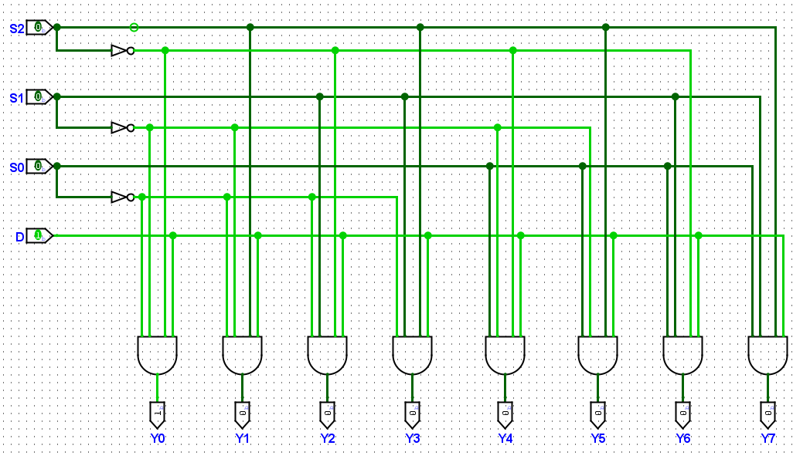

---

## Cadence Virtuoso Design

### Schematic Design

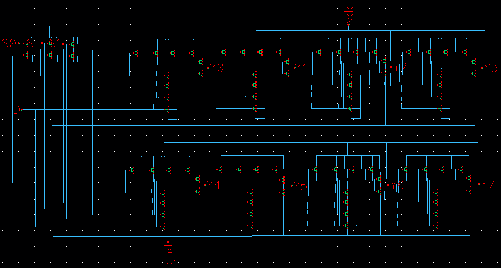

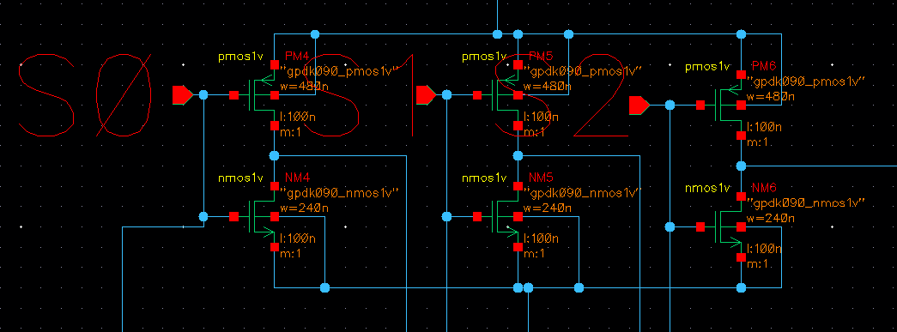

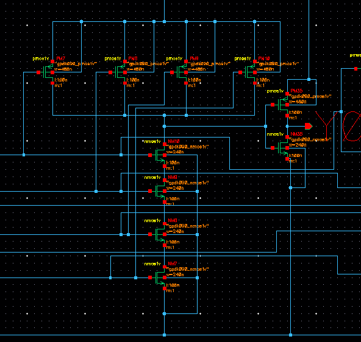

---

### Layout Design

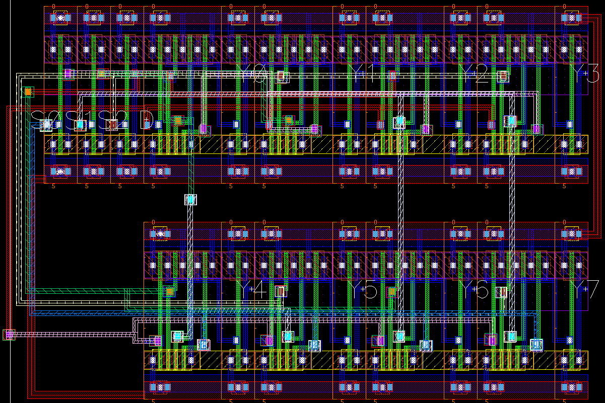

---

### Symbol View

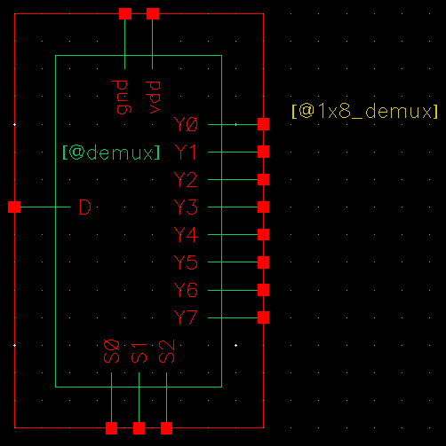

---

## RC Extraction (RCX)

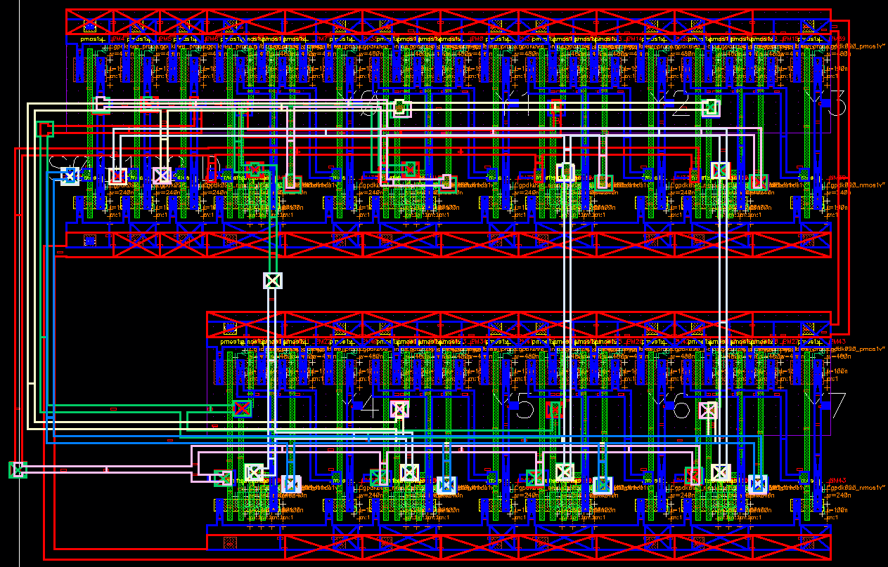

---

## Performance Analysis

### Input vs Output Waveform

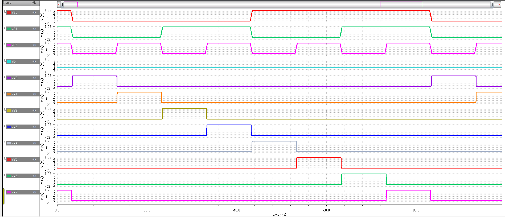

### Power Analysis

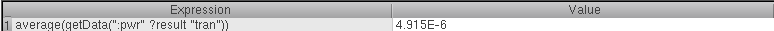

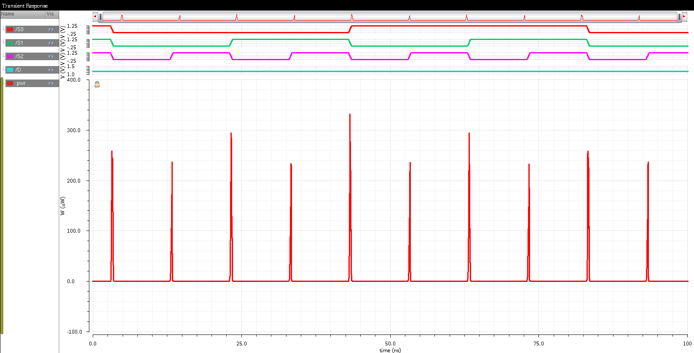

---

## Key Metrics

- Propagation delay analyzed from simulation results  
- Power consumption evaluated using Cadence tools  
- Layout verified using RC extraction (parasitic effects included)

---

## Stick Diagram

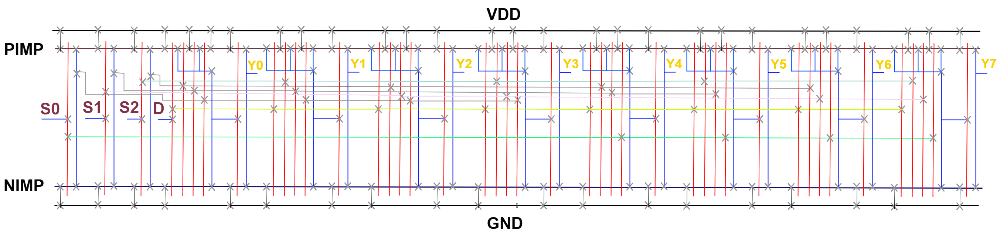

---

## Tools Used

- Logisim (Digital Simulation)
- Cadence Virtuoso (Schematic & Layout)
- CMOS VLSI Design Flow Tools
- Git & GitHub for version control

---

## Conclusion

The project successfully demonstrates the full VLSI design cycle of a 1×8 Demultiplexer. It connects theoretical digital design concepts with practical CMOS implementation and physical layout considerations.

---

## Author

Shahriar Jawwad  
Department of Electronics & Telecommunication Engineering
